# Portfolio Project 3


## Hangman - The Classic Word-Guessing Game

Hangman is a classic word-guessing game that challenges your word knowledge and puzzle-solving skills. In this timeless pastime, you'll need to decipher a hidden word one letter at a time before the hangman is completely drawn.


### View my live project here.

[Live Link](https://hang-man01-c67c03b9b487.herokuapp.com/)

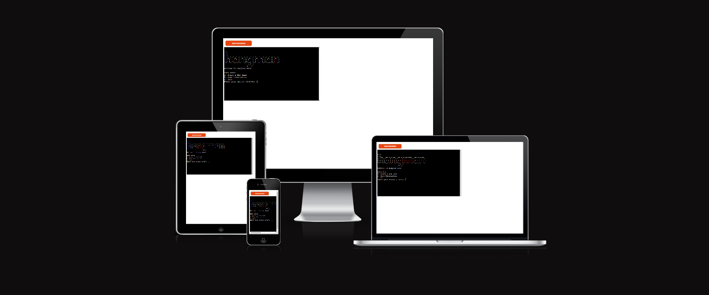

## How to Play:

Start a New Game: Begin a new game and prepare to uncover the mystery word.

Guess the Word: Guess the letters that you believe are part of the hidden word. If your guess is correct, the letter will be revealed in its respective position(s). If you guess incorrectly, a part of the hangman will be drawn as a penalty.

Word Completion: Your goal is to reveal the entire word before the hangman figure is completed. Make sure to guess the word correctly within a limited number of attempts to win the game.

Strategy and Skill: Use your knowledge of words, common letters, and the context of the game to make educated guesses. Every incorrect guess brings you closer to the hangman's completion!

### Hangman Rules:

You have a set number of attempts to guess the word correctly.
For each incorrect letter guess, a part of the hangman (a stick figure) is drawn.
The game is over if the hangman figure is fully drawn before you guess the word.
You win the game if you guess the word before the hangman is complete.

### Are You Up for the Challenge?

Hangman is a game that tests your vocabulary and word recognition skills while providing hours of fun and entertainment. Whether you're a word wizard or just looking for a fun way to pass the time, Hangman is the perfect choice. So, what are you waiting for? Start a new game and see if you can outsmart the hangman! Good luck!

### As a first-time visitor to the Hangman game, I want to:

1. Learn About the Game:

    Quickly understand the concept and rules of the game, even if I've never played Hangman before.

2. Access a Game Description:

    Find a clear and concise description of the Hangman game, including how it's played and the objective.

3. Understand the User Interface:

    Easily navigate the game's main menu and options.
    Know how to start a new game or access any additional features.

4. Receive Clear Instructions:

    Access instructions or a tutorial on how to make letter guesses, what happens when I guess correctly or incorrectly, and how to win or lose the game.

5. Feel Welcomed and Encouraged:

    Experience a welcoming and friendly atmosphere that encourages me to start a new game and have fun.

### As a returning visitor to the Hangman game, I want to:

1. Quickly Resume a Game:

    Easily pick up where I left off in any ongoing games from my previous visit.

2. Start a New Game Effortlessly:

    Have a straightforward option to start a new Hangman game if I wish to begin a fresh round.

3. Enjoy a Seamless Experience:

    Enjoy a seamless and consistent gaming experience that I've come to appreciate.

4. Feel a Sense of Progress:

    Continue improving my word-guessing skills and enjoy the sense of progress and accomplishment.

5. Feel Engaged and Motivated:

    Be motivated to return to the game and continue my Hangman adventure.

### As a frequent visitor to the Hangman game, I want to:

1. Effortlessly Navigate the Game:

    Quickly and easily navigate through the game menu and features.

2. Enjoy a Smooth and Bug-Free Experience:

    Expect a seamless, stable, and bug-free gaming experience, allowing me to fully immerse myself in the game.

3. Challenge Myself:

    Have the option to increase the game's difficulty to continually challenge and improve my word-guessing skills.


## Wireframes

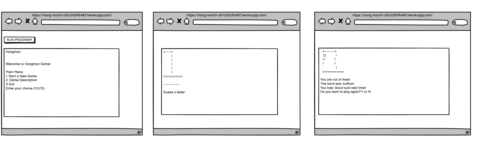

## Game Features

1. Game Starting Screen


2. Game Description

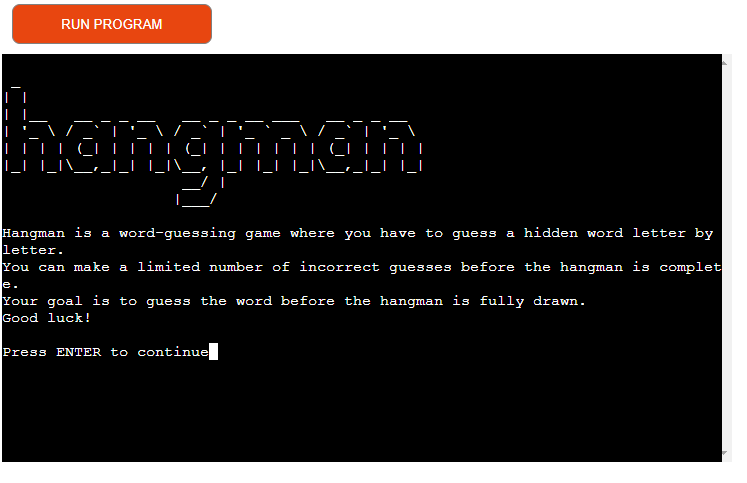

3. Main playing game screen
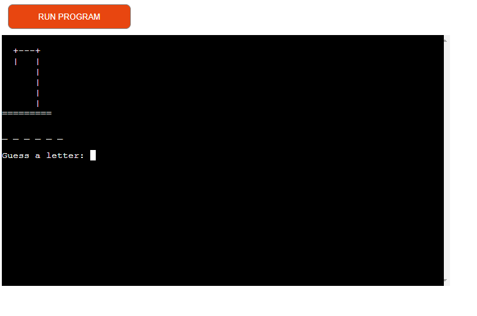

4. When the game is over

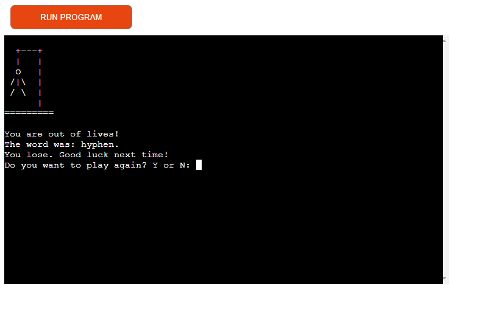

5. Winning Screen

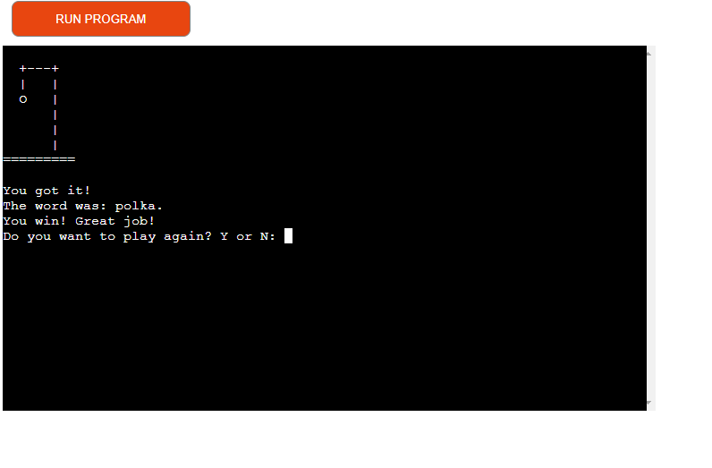

6. Special character


7. Numbers


## Flowchart 

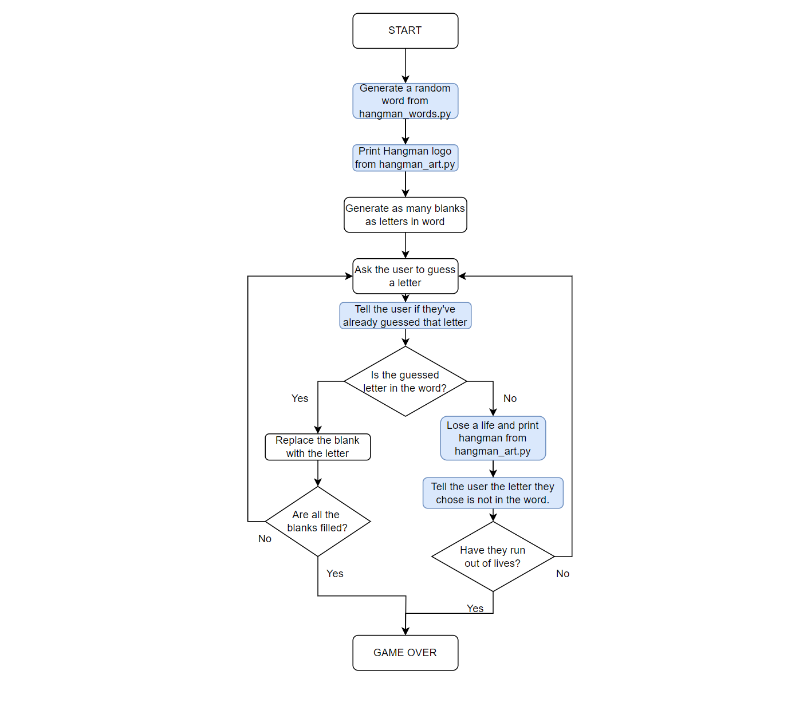

## Languages used

* [Python](https://www.python.org/): the main language used to create the game.

## TESTING

TODO: Add testing information here

## Bugs
I ran the check throughout project code, but i was getting few errors. Most of them were space, tabs, and line too long and trailing whitespace. I was able to fix these erorrs. 

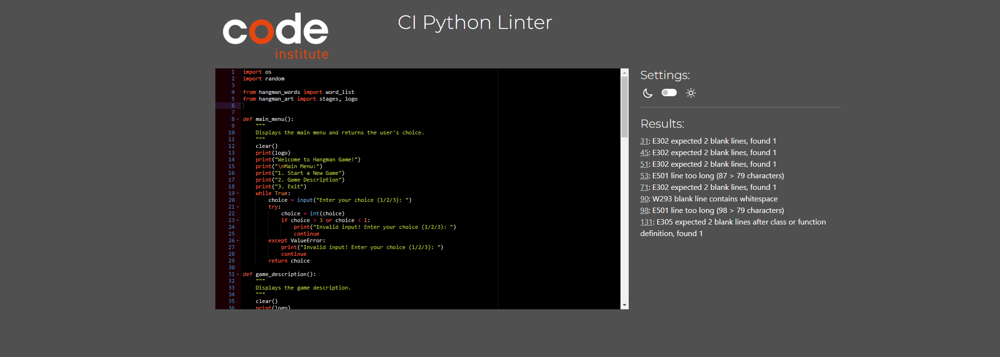

## Validation

1. Python Run.py report

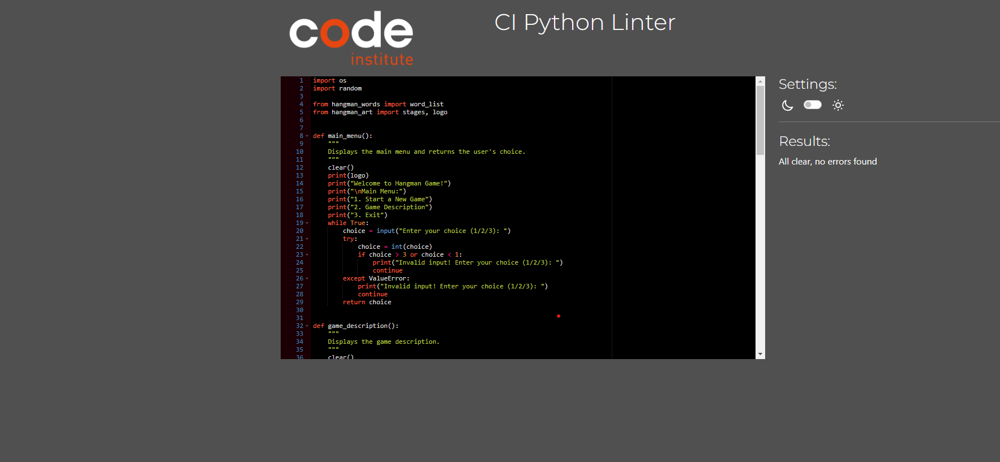

2. Python Words.py report

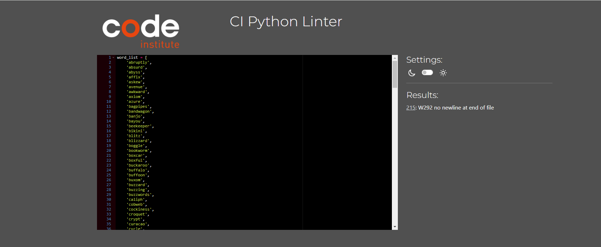

3. Python Art.py report

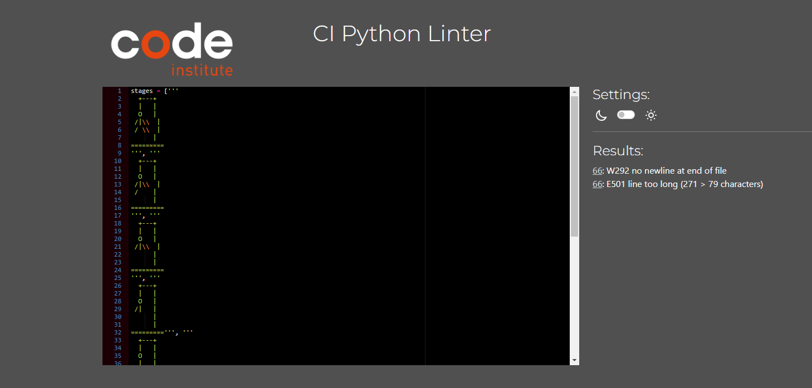

4. No Error report


## Deployment 

This website was constructed in VS Code and deployed on [Heroku](https://id.heroku.com/login)

### Activating your Heroku Student pack

* [Heroku-Github Student Pack](https://www.heroku.com/github-students)
* Click "Get the student offer"
* Login with Heroku if necessary
* Click "Verify with GitHub"
* Click "Authorize heroku"
* In order to receive the Heroku credits, payment details are required.
* In the new tab, click "Add credit card".
* Enter your payment details as requested and then head back to the Heroku sign up process
* Enter your details, ensuring to put "Code Institute" as your School name, heed the warning and then click "Send"
* Read Heroku's terms and click "Agree" to continue
* A thank you message will be shown, indicating that it can take up to 24 hours for the request to be processed

### Adding an App to Heroku

* On the main page of your heroku account, select the NEW tab
* Then select Create New app

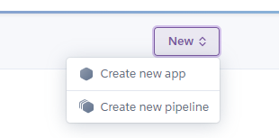

* Add an Application name
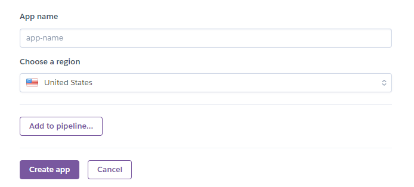

* On a new page, Select github as your deployment method and select connect to GitHub
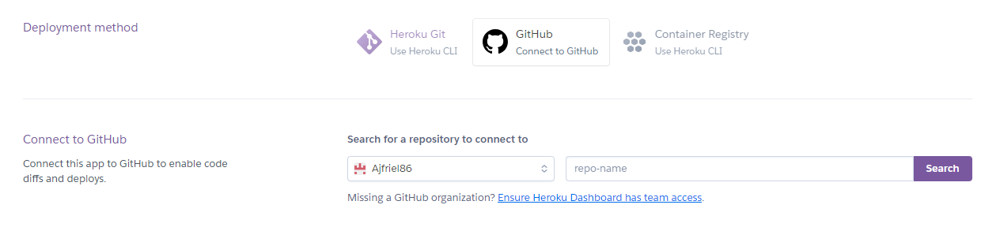

* Select the Repository, you would like to host on Heroku
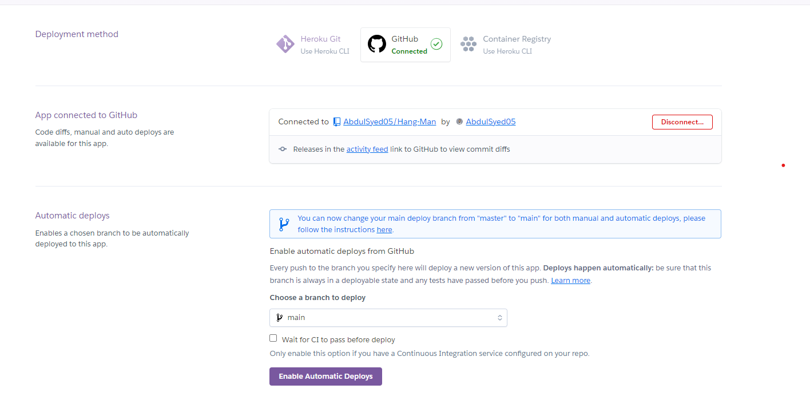

* Once the Repository is connected, you either choose Automatic deploy or manually deploy branch.
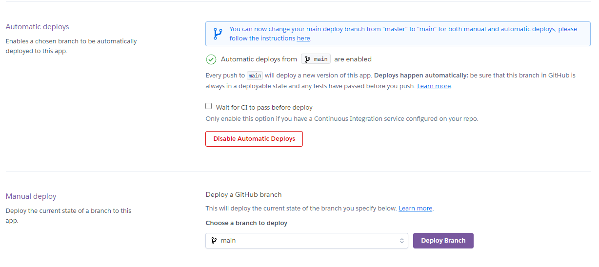

### How to run this project locally

To clone this project from GitHub

1. Follow this link to the [Project GitHub repository](https://hang-man01-c67c03b9b487.herokuapp.com/)
2. Under the repository name, click "Clone or download".
3. In the Clone with HTTPS section, copy the clone URL for the repository.
4. In your local IDE open Git Bash.
5. Change the current working directory to the location you want the cloned directory to be made.
6. Type ` git clone ` and then press the URL you copied in Step 3
```
$ git clone https://github.com/YOUR-USERNAME/YOUR-REPOSITORY
```
7. Press Enter. Your local clone will be created.

```
$ git clone https://github.com/YOUR-USERNAME/YOUR-REPOSITORY
> Cloning into `CI-Clone`...
> remote: Counting objects: 10, done.
> remote: Compressing objects: 100% (8/8), done.
> remove: Total 10 (delta 1), reused 10 (delta 1)
> Unpacking objects: 100% (10/10), done.
```

##  Credits & Acknowledgements

* [Hangman game idea in 16 minutes](https://www.youtube.com/watch?v=pFvSb7cb_Us) : I followed this tutorial to get ideas on how to create python game. 

* [Blessed package](https://pypi.org/project/blessed/) : This external link was also used to get ideas on how to create a terminal app. 

* I owe my mentor Aleksei Konovalov a lot of credit for great mentoring and support. Your dedication to my development, patience in answering my questions, and willingness to invest your time and energy in my success have not gone unnoticed. I can genuinely say that I am a better [student/employee/mentee] because of your mentorship. And I wish you the best in your new career.

* I owe the Slack community a great deal of credit also for their responsiveness and willingness to always help with small problems!